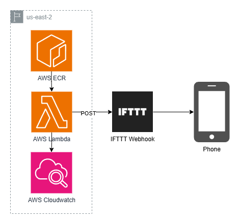

# HomeAutomation

## Table of Contents
[Weather Alerts](#weather-alerts)

## Weather Alerts
This service utilizes data from the National Weather Service to send alerts if there is rain in the forecast. There is a Lambda that is triggered to run every day at 4:30 AM EST, which queries the NWS API for local weather data. In the event that rain is in the forecast, this Lambda will send a POST request to a defined IFTTT webhook. IFTTT is an app that allows for a wide variety of automations, in this scenario we are create a webhook in the application and set up whatever notification we would like. The webhook URL is encrypted and stored in AWS Secrets Manager. When a POST request is sent to the configured webhook, a notification is sent from the application. 
